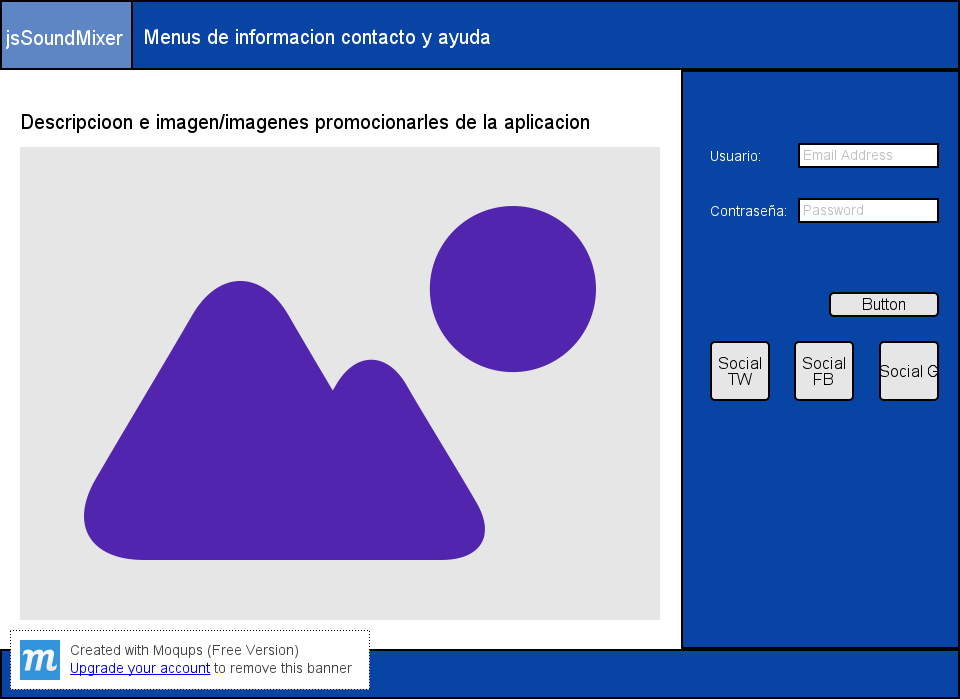
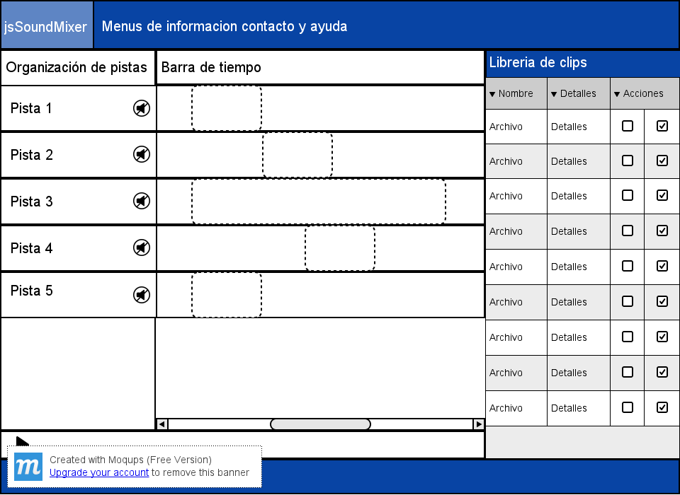

## Documentación general del proyecto

### Tabla de contenidos

<!-- MarkdownTOC depth=0 -->

- Colaboradores
- Idea
  - Descripción general del proyecto - Responsable (DM-HB)
  - Objetivos - Responsable (DM)
  - Benchmarking - Responsable (DM)
  - Tecnologías a utilizar - Responsable (DM-HB)
    - Front end
    - Back end
    - Bases de datos
- Diseño
  - Mapas de Navegación - Responsable (HB)
  - Mockups - Responsable (HB)
    - Pagina del login
    - Pagina del la aplicación
    - Diagrama de Despliegue - Responsable (DM)
    - Bibliografía

<!-- /MarkdownTOC -->

### Colaboradores
* Diego Montoya (DM)
* Hans Burbano (HB)

### Idea

#### Descripción general del proyecto - Responsable (DM-HB)
Este proyecto pretende construir una aplicación para la composición en línea mediante clips de sonidos que podrán ser subidos por el usuario.

Existen dos enfoques/patrones de diseño populares para este tipo de aplicaciones:

* Enfoque DJ
* Enfoque Audacity

El enfoque utilizado para nuestra aplicación será el patrón Audacity y pretendemos integrar la siguiente funcionalidad:

- [ ] Login
- [ ] Registro
- [ ] Recuperación de contraseña (O)
- [ ] Agregar un nuevo clip de sonido
- [ ] Adicionar una nueva pista
- [ ] Adicionar un clip a una pista en un determinado tiempo
- [ ] Modificar la posición temporal del clip en el tiempo
- [ ] Silenciar una pista (O)
- [ ] Compartir la pista en redes sociales (O)
- [ ] Permite descargar las composiciones creadas (O)

*(O) - Característica opcional*

#### Objetivos - Responsable (DM)
Los objetivos a lograr en este proyecto son:

- [ ] Realizar una aplicación web en la cual podamos agregar clips de sonido a una pista, conjunto de hasta 5 clips (cada uno sería un instrumento musical), y poderlas escuchar en conjunto o por separado.
- [ ] Se debe poder agregar, editar o eliminar pistas y su información relacionada.
- [ ] El acceso a la aplicación web será mediante un loggeo de usuarios.
- [ ] Debe tener una alta usabilidad para que en un futuro si se desea se pueda complementar la aplicación y que sea últil para la grabación de pistas de grupos musicales a distancia, es decir, cada integrante del grupo pueda grabar por separado su clip de sonido (su instrumento) y después subirlo a la aplicación para poder escuchar la pista que contiene los demás clips.

#### Benchmarking - Responsable (DM)

|Aplicacion|Caracteristicas|Observaciones|
|-----------------------|--------|------------|
|[Soundation](http://soundation.com)|Enfoque Audacity|Secuenciador en línea que permite mezclar varias pistas y aplicar efectos sobre ellas|
|[Party Cloud](http://www.partycloud.fm)|Enfoque DJ|Simulador de DJ en línea que te permite mezclar dos canciones e interactuar con ellas en una consola de DJ virtual|
|[Mixifi](http://www.mixify.com)|Enfoque DJ|Simulador de DJ en línea que te permite realizar mezclas y realizar streaming en tiempo real de lo que estás mezclando|
|[Auto Joiner](http://audio-joiner.com)|Enfoque Audacity|Secuenciador en línea que te permite unir varias pistas ya sean pistas que tienes guardadas en tu PC o mediante un micrófono grabarlas en línea y unirlas|

#### Tecnologías a utilizar - Responsable (DM-HB)

<table>
  <thead>
    <tr>
      <th>Front end Hans Burbano</th>
      <th>Back end Diego Montoya</th>
      <th>Base de datos Hans Burbano</th>
    </tr>
  </thead>
  <tbody>
    <tr>
      <td>HTML5</td>
      <td>PHP</td>
      <td rowspan="6">MySQL</td>
    </tr>
    <tr>
      <td>JavaScript</td>
      <td>Yii</td>
    </tr>
    <tr>
      <td>jQuery</td>
      <td></td>
    </tr>
    <tr>
      <td>Twitter BS</td>
      <td></td>
    </tr>
    <tr>
      <td>CSS</td>
      <td></td>
    </tr>  
    <tr>
      <td colspan="2" align="center">REST - JSON</td>      
    </tr>   
  </tbody>
</table>

###### Front end
Con el conjunto de herramientas anteriormente descritas se desarrollará una aplicación que permitirá al usuario mezclar archivos de audio sin la necesidad de instalar ningún plugin adicional.
 *El alcance del proyecto en cuanto a compatibilidad de navegadores está limitado a funcionar en la última versión de Google Chrome.*

###### Back end
Se piensa implementar mediante el framework Yii una API REST con la funcionalidad requerida.

###### Bases de datos
Para la información correspondiente a la mezcla de pista y como éstas se encuentran organizadas en una composición. Se piensa utilizar la base de datos MySQL.  

### Diseño

#### Mapas de Navegación - Responsable (HB)
Mapas de navegación

- [ ] Página de inicio a dos columnas
  - [ ] Login
      - [ ] Recuperar contraseña 
  - [ ] Registro
- [ ] Aplicación
  - [ ] Agregar clips/archivos
  - [ ] Modificar posición temporal
  - [ ] Silenciar pista

#### Mockups - Responsable (HB)

###### Página del login

###### Página de la aplicación

###### Diagrama de Despliegue - Responsable (DM)

###### Bibliografía
